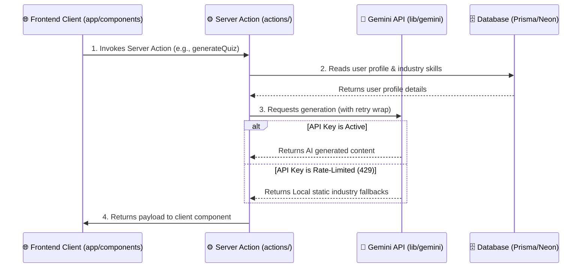

# 🗺️ AiCareer Project Architecture & Directory Structure

This document outlines the codebase structure of the **AiCareer** platform. Since **Next.js is a full-stack framework**, it blends the client (frontend) and server (backend) logic into a unified repository. Below is a detailed breakdown of how the files are organized for readability and further analysis.

---

## 📂 Directory Layout

```
Career-Coach-With-AI/
├── actions/             # ⚙️ Server Actions (Backend APIs / Database mutations)
├── app/                 # 🌐 Routing & Pages Layer (Next.js App Router)
├── components/          # 🎨 Frontend UI Elements & Primtives
│   ├── ui/              #   └─ Shadcn UI basic primitives (Buttons, Cards, Dialogs)
├── data/                # 📊 Static Content / Seed Configuration
├── hooks/               # 🔄 Custom Client-side React Hooks
├── lib/                 # 🛠️ Central Core Utilities & Integrations
├── prisma/              # 🗄️ Database Schema & Migrations
└── public/              # 🖼️ Static Assets (Images, Icons)
```

---

## 🧱 Layered Breakdown

### 1. 🌐 The Frontend / UI Layer

Responsible for rendering pages, layouts, custom interactive widgets, and managing client-side React states.

- **`app/`**: Standard Next.js App Router structure.
  - `app/(auth)/`: Handles user registration, sign-in, and sign-up flows using Clerk.
  - `app/(main)/`: Protected application routes:
    - `/onboarding`: Guided industry setup form for new users.
    - `/dashboard`: Real-time market trends and salary metrics.
    - `/resume`: Markdown-based Resume Builder and PDF export.
    - `/interview`: Technical interview prep analytics and quiz history.
    - `/ai-cover-letter`: List and generator for tailored job cover letters.
  - `app/globals.css`: Global design tokens, gradients, and scroll animations.
- **`components/`**: Reusable interactive React components.
  - `components/hero-animation.jsx`: Immersive Framer Motion SVG layout animating dynamic career paths.
  - `components/career-chatbot.jsx`: Sidebar chat panel ("Career Buddy") for instant career advice.
  - `components/header.jsx`: Brand header containing navigation and personalized greeting badges.
  - `components/ui/`: Standard UI primitives from **Shadcn UI** (buttons, input fields, dropdown menus).
- **`hooks/`**: Custom hooks for fetch handling and local state control (e.g., [use-fetch.js](file:///c:/Users/Google/Desktop/ai%20career/Career-Coach-With-Ai/hooks/use-fetch.js)).

### 2. ⚙️ The Backend / Server / Logic Layer

Responsible for executing database mutations, handling integrations with Google's Gemini models, and managing background workflows.

- **`actions/`**: Next.js Server Actions. These run exclusively on the server and function as secure RPC endpoints, removing the need for raw REST API controllers.
  - [user.js](file:///c:/Users/Google/Desktop/ai%20career/Career-Coach-With-Ai/actions/user.js): Handles user database profiles, updates, and onboarding checks.
  - [dashboard.js](file:///c:/Users/Google/Desktop/ai%20career/Career-Coach-With-Ai/actions/dashboard.js): Generates industry trends/insights.
  - [resume.js](file:///c:/Users/Google/Desktop/ai%20career/Career-Coach-With-Ai/actions/resume.js): Saves user resumes and handles AI resume enhancements.
  - [interview.js](file:///c:/Users/Google/Desktop/ai%20career/Career-Coach-With-Ai/actions/interview.js): Handles technical mock quiz generations and logs scores.
  - [cover-letter.js](file:///c:/Users/Google/Desktop/ai%20career/Career-Coach-With-Ai/actions/cover-letter.js): Tailors letter drafts for job descriptions.
- **`lib/`**: Core utilities and database connections.
  - [gemini.js](file:///c:/Users/Google/Desktop/ai%20career/Career-Coach-With-Ai/lib/gemini.js): Centralized API gateway for Gemini model calls, carrying exponential backoff retries and static model fallbacks.
  - [checkUser.js](file:///c:/Users/Google/Desktop/ai%20career/Career-Coach-With-Ai/lib/checkUser.js): Checks session profiles and performs user synchronization from Clerk to Prisma.
  - `lib/inngest/`: Background workers for automated weekly insights updates.
  - `lib/prisma.js`: Singleton instance for database queries.

### 3. 🗄️ Database & Schema Layer

- **`prisma/schema.prisma`**: Defines relational models for **Users**, **Resumes**, **Cover Letters**, **Assessments**, and **Industry Insights** deployed on PostgreSQL.

---

## 🔄 Dataflow Architecture


